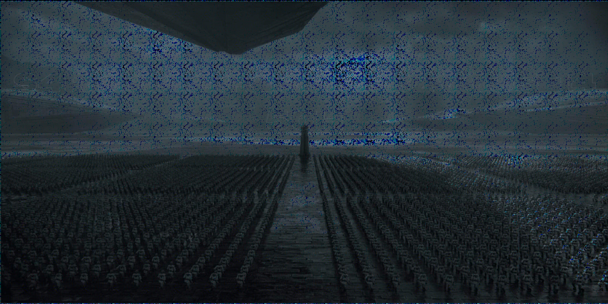

# A Convoluted Cipher
We are given the [key.jpg](./key.jpg) with dimensions of `70 x 70` & [encrypted_lock.png](./encrypted_lock.png) with dimensions of `1400 x 70`. It is evident that we need to perform some operations on the 200 chunks of the encrypted lock image with the key to get the flag.

In this case, on performing the `ImageChops.subtract()` operation from the **PIL** python library on the encrypted lock & the key, we get the flag. You may refer to this [script](./solve.py)

We had a tough time reading the content of the image

Flag : `cruXipher{s4r64uk4r_r3nd3zvou5_145oh}`