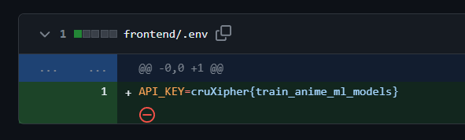

# Free API Key
- We were provided with an [image](./image.jpg) of a person & landed up on this [GitHub Profile](https://github.com/TheComputerM/)

- `jwt-cracker` was the recently updated repository, so started looking into the `dev` branch of it

- Found the flag in one of the [commits](https://github.com/TheComputerM/jwt-cracker/commit/53449923f6d8bc9b06657a44a04964c8711a2132)

Flag : `cruXipher{train_anime_ml_models}`