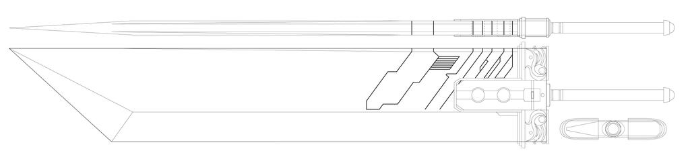

# Furagu No Yaiba


```
You are Zorojoru, a pupil studying the art of forging Nichirin swords in the swordsmith village under Hotaru Haganezuka himself. Haganezuka isn't satisfied with your work until now, but is willing to give you one last chance. He has given you one night to forge the best sword you ever have before. All he has left you with is a blueprint of the sword you need to forge and multiple pieces of ores. The blueprint has the following message written behind it, to help you understand how to choose your ores:

"wh47 g00d 15 4 blu3pr1n7 1f 17 d035 n07 73ll y0u wh47 y0u n33d".

The final judgement of the sword will be done by Hotaru himself. Note that the ores determine the quality of the sword, so the Ones you pick are more important than you may think. The flag is in the format cruXipher{<flag>}
```

We are given an image. 



Downloading it and running binwalk on it reveals a [hidden zip file](./_blueprint.jpg.extracted/4881.zip). 

After extraction, we can search for 'cruXipher' within the zipfile using a search function on any Zip Viewer and get the flag.

Flag: `cruXipher{r37urn_70_7h3_0n3_p13c3_m4ng4}`