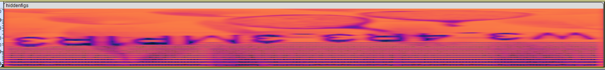

# Hidden Figures

```
Hari Seldon, the galaxy’s most famous psychohistorian, has just been killed. His protege finds a solitary soundbite that belonged to his late mentor, however, the audio appears to be heavily garbled. Can you make any sense of it?

NOTE: Any flag(s) uncovered must be submitted as lowercase alphanumeric strings enclosed in cruXipher{}.
```


We are given an Audio file. The challenge name hints towards figures being hidden.

Opening up the file in Audacity and Looking at it under a spectrogram reveals the flag



Flag : `cruXipher{w3_4r3_3mp1r3}`
