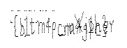

# Sweeping Crop Failure

Get the hex data from the pcapng file:

```
tshark -T fields -e data.text -o data.show_as_text:TRUE -r capture.pcapng
```

This gives a [ppm file](./image.ppm), with variable height and width.

We tinker around with these dimensions but to no avail.

Upon reading more into it, we try converting the data acquired [to binary](./binary_data).

We find the length of the ppm file is 6808 bits, which has the factors `2^3 * 23 * 37`. We use [this tool](https://www.dcode.fr/binary-image) to extract the image from the bits.

We brute force the length and width, since the number of factors isn't a lot, and get the correct height and width. We obtain the following image:



## Flag

    cruXipher{b1tm4p_m4g1c}
