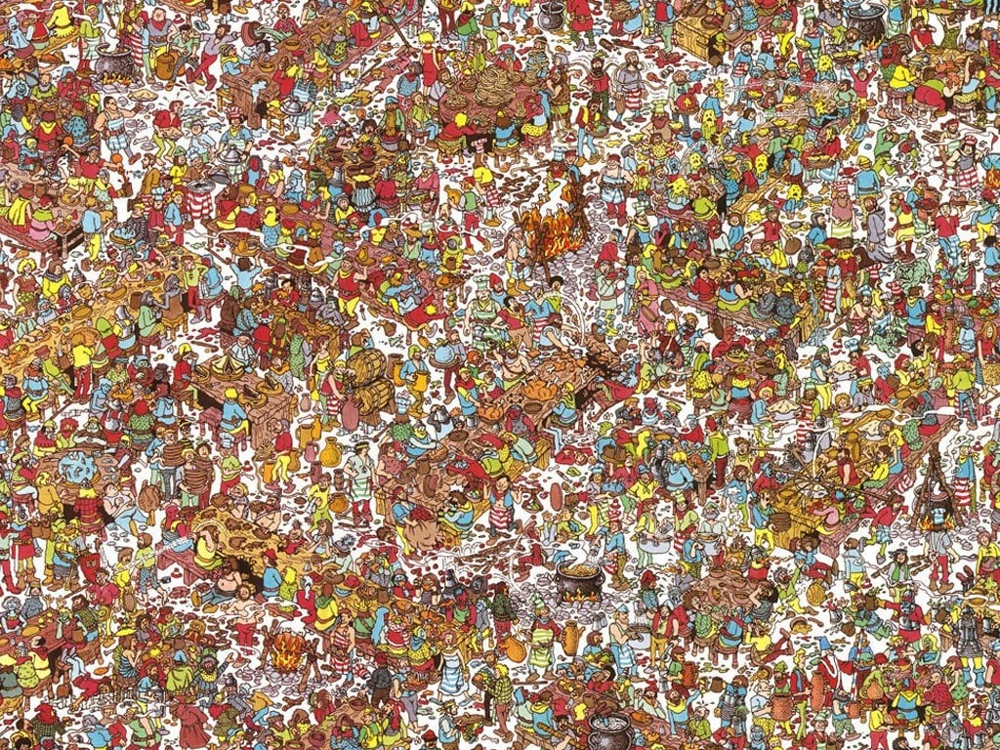

# Where's Waldo

```
Oh no, it looks like we gave you the wrong PDF, this one doesn't seem to have a password, nor is Waldo here. Or maybe he is? Could you try searching for him in this PDF? The flag is in the format cruXipher{<flag>}

Hint
The text in the pdf looks awfully similar to a *spam* email.
```

We are given a PDF with a clue related to spam. Using [Spam Mimic](https://www.spammimic.com/) we decode it, which yeilds the link to an image.

Decoded Link : `https://files.catbox.moe/6tyvha.jpg`

Downloading the image



 and running steghide on it yeilds a [base64 string](./steganopayload583495.txt), which when decoded gives an [imgur link](https://imgur.com/CzDPAUF).

Downloading the imgur image


 and running steghide on it again, yields another [base64 string](./steganopayload583054.txt), which gives the flag when decoded.

Flag: `cruXipher{n0b0dy_ev3r_ask5_how5_w4ld0}`